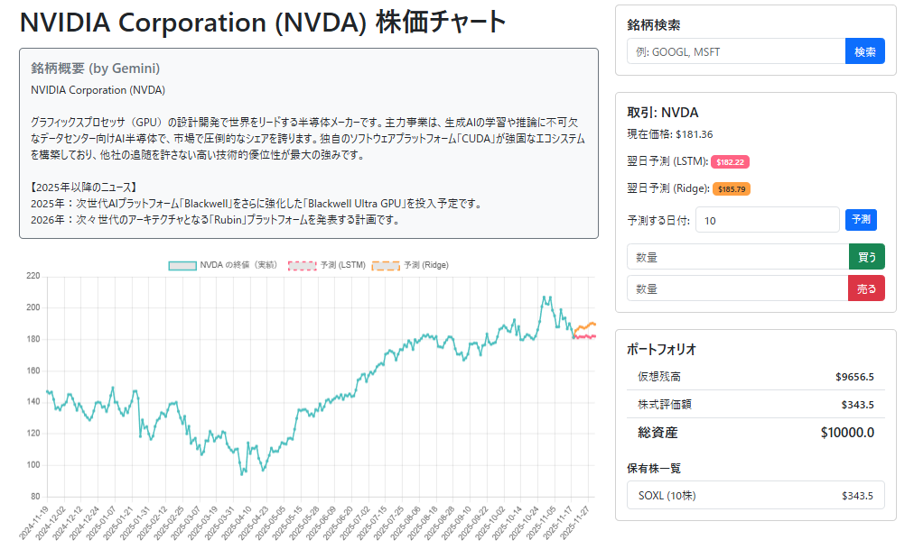
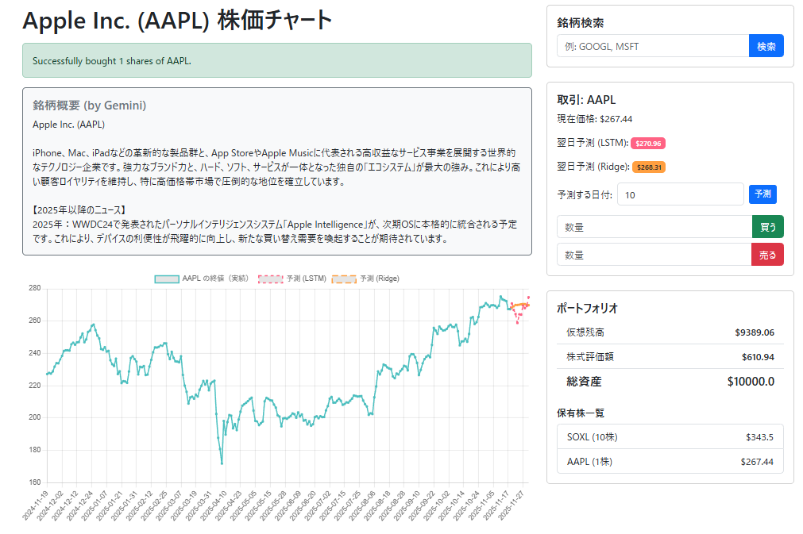

# 実行例


## 株の購入時


仮想環境の作成
```
conda create -n stockapp python=3.9
```
仮想環境の有効化
```
conda activate stockapp
```
必要なライブラリのインストール
```
pip install -r requirements.txt
```
環境変数の設定
```
export GEMINI_API_KEY="YOUR_GEMINI_API"
```
仮想環境の無効化
```
conda deactivate
```
仮想環境の削除
```
conda env remove -n stockapp
```
