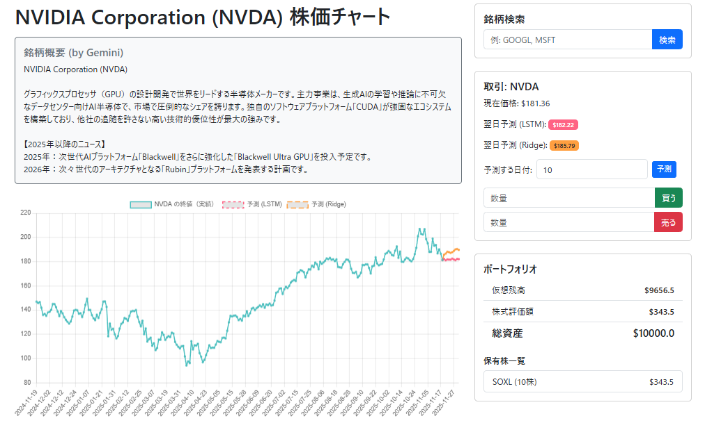
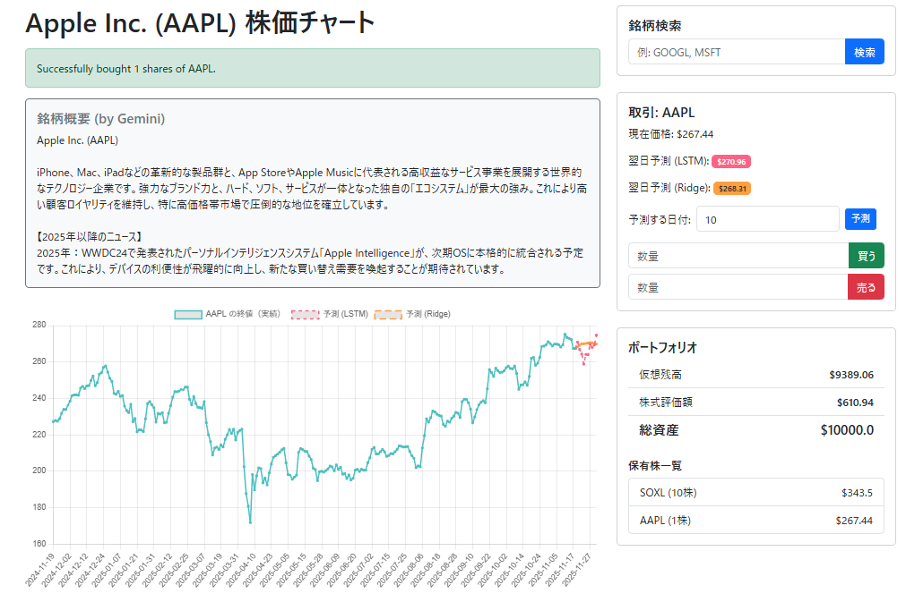

# 実行例


## 株の購入時


仮想環境の作成
```
conda create -n stockapp python=3.9
```
仮想環境の有効化
```
conda activate stockapp
```
必要なライブラリのインストール
```
conda install pip
python -m pip install -r requirements.txt
```
環境変数の設定
```
export GEMINI_API_KEY="YOUR_GEMINI_API"
```
アプリの起動
```
uvicorn app:app --reload
```
仮想環境の無効化
```
conda deactivate
```
仮想環境の削除
```
conda env remove -n stockapp
```

デイトレ用の画面を作ってください
yfinanceでは過去の1分足・5分足などの日中株価を取得し、
予測モデルに過去の1日単位で学習させ
1日の値動きをinterval単位で予測できるようにしてください
(例えば1mでn単位後の予測をさせた場合はn分後までの株価を予測)


つまりデイトレ用の予測モデルを作ってデイトレ画面と重ね合わせたいということです

| `interval`   | 内容   | おおよその取得可能期間 |
| ------------ | ---- | ----------: |
| `1m`         | 1分足  |       直近約8日 |
| `2m`         | 2分足  |       直近60日 |
| `5m`         | 5分足  |       直近60日 |
| `15m`        | 15分足 |       直近60日 |
| `30m`        | 30分足 |       直近60日 |


